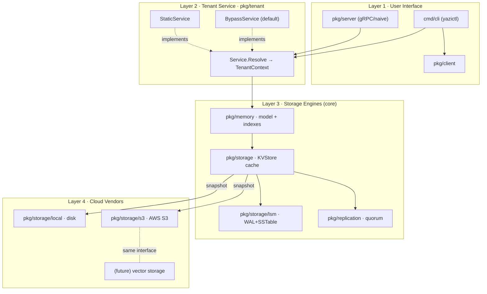
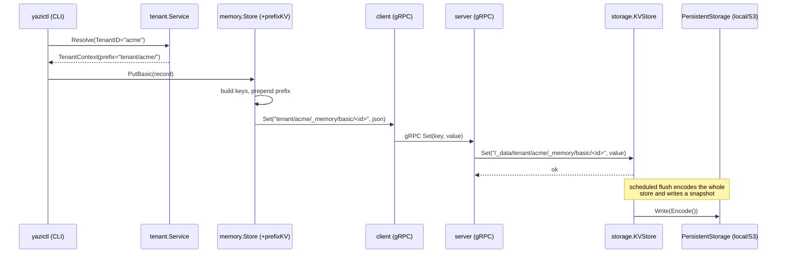
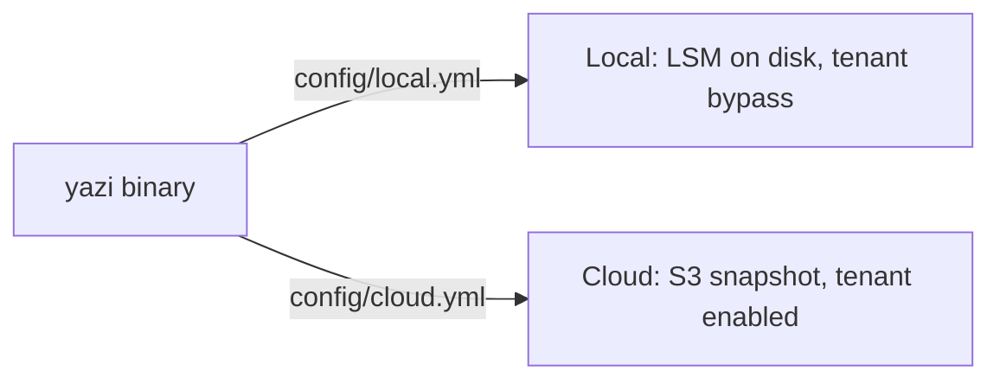

# Architecture

This document describes the design and implementation of yazi as a **layered
memory system for LLM agents**. yazi started as a lightweight KV server with
pluggable protocol, persistence and storage-engine layers; on top of that core
it now provides a structured memory model and the seams needed to run the same
binary locally (single-tenant, offline) or in the cloud (company-wide,
multi-tenant, S3-backed).

---

## 1. Goals

- **Reuse the existing engine.** The KV/storage core (in-memory cache, LSM with
  WAL + SSTable, async replication) stays the reusable center and is unchanged
  by the new layers.
- **Structured memory for agents.** A JSON memory model (basic / advanced /
  policy) layered on the KV store, with secondary indexes for filtered queries.
- **Tenant isolation as a thin seam.** A pluggable tenant-service layer that is
  a no-op by default and namespaces keys per tenant when enabled. A separate
  project can supply a real multi-tenant implementation without touching the
  core.
- **Cloud persistence.** A pluggable cloud-vendor backend (AWS S3 /
  S3-compatible) behind the existing persistence interface.
- **One binary, two deployment modes.** Local vs cloud is a configuration
  choice, not a code change.

---

## 2. The Four Layers

```
┌──────────────────────────────────────────────────────────────────────┐
│  Layer 1 — USER INTERFACE                                            │
│  cmd/cli (yazictl)   pkg/server (gRPC / naive)   pkg/client          │
│  • memory subcommands  • KV RPC endpoints        • protocol clients  │
└───────────────────────────────┬──────────────────────────────────────┘
                                │  resolve tenant, derive key prefix
┌───────────────────────────────▼──────────────────────────────────────┐
│  Layer 2 — TENANT SERVICE  (pkg/tenant)                              │
│  Service.Resolve(Request) -> TenantContext.KeyPrefix()              │
│  • BypassService (default, "" prefix)   • StaticService             │
│  • interface point for an external multi-tenant implementation      │
└───────────────────────────────┬──────────────────────────────────────┘
                                │  prefixed /_memory/... keys
┌───────────────────────────────▼──────────────────────────────────────┐
│  Layer 3 — STORAGE ENGINES  (the reusable core)                     │
│  pkg/memory: BasicMemory / AdvancedMemory / CognitivePolicy + index │
│  pkg/storage: KVStore cache, LSM (WAL+SSTable), replication/quorum  │
└───────────────────────────────┬──────────────────────────────────────┘
                                │  PersistentStorage.Write/Read(snapshot)
┌───────────────────────────────▼──────────────────────────────────────┐
│  Layer 4 — CLOUD VENDORS  (persistence backends)                    │
│  pkg/storage/local (disk)        pkg/storage/s3 (AWS S3 / compatible)│
│  • extension point: AWS vector storage, other clouds                │
└──────────────────────────────────────────────────────────────────────┘
```

Dependencies point **downward only**. Each boundary is a Go interface, so any
layer can be replaced without modifying the others. This is enforced by a test
in `pkg/arch` that fails if the storage engine ever imports the tenant or UI
layers, or if the tenant layer imports storage.



---

## 3. Layer Details

### Layer 1 — User Interface

| Component | Role |
| --- | --- |
| `cmd/cli` (`yazictl`) | KV commands (`get/set/del/...`) and `memory <basic\|advanced\|policy> <put\|get\|list\|del>`. Builds the memory store client-side and routes it through the tenant seam via the persistent `--tenant` flag. |
| `pkg/server` | Server bootstrap: selects protocol, storage engine, persistence backend, replication, and constructs the tenant service. |
| `pkg/server/grpc`, `pkg/server/naive` | Protocol handlers. They serve raw KV requests under `/_data/` and reserve `/_meta`, `/_raft`. |
| `pkg/client` | Protocol-agnostic client (`grpc` / `naive`). |

> **Where memory keys are built.** The `memory.Store` is constructed
> **client-side** in `cmd/cli` (`newMemoryStore`). It builds the `/_memory/...`
> keys and index entries; only raw KV ops (`Get/Set/Del/MGet/MSet/Keys`) cross
> the wire. The server is a generic KV server that does not know about memory —
> which is exactly why tenant namespacing is applied at the memory-store seam.

### Layer 2 — Tenant Service (`pkg/tenant`)

```go
type Request struct {
    TenantID string
    Metadata map[string]string
}

type TenantContext struct { /* id, prefix */ }
func (c TenantContext) KeyPrefix() string  // "" in bypass mode

type Service interface {
    Resolve(req Request) (TenantContext, error)
}
```

- **`BypassService`** (default) — resolves to an empty prefix; keys keep the
  original `/_memory/...` layout. Selected whenever no tenant is configured.
- **`StaticService`** — pins to one tenant id; a request's `TenantID` overrides
  the default, so one process can act for different tenants per call.
- **`New(mode, id)`** — config-driven constructor (`""`/`"bypass"` → bypass,
  `"static"` → static).

Prefix derivation is deterministic and sanitized: a tenant id `acme` yields
`tenant/acme/`; unsafe characters are mapped to `_`; the same id always yields
the same prefix.

### Layer 3 — Storage Engines (the core)

**Memory model** (`pkg/memory`):

| Type | Purpose | Key | Indexes |
| --- | --- | --- | --- |
| `BasicMemory` | raw records: preference / history / decision / context | `/_memory/basic/{id}` | kind, scope, subject, tag |
| `AdvancedMemory` | distilled experience (title, summary, evidence) | `/_memory/advanced/{id}` | template, tag |
| `CognitivePolicy` | role/domain/scenario policy | `/_memory/policy/{id}` | role, domain, scenario, tag |

Records are JSON; secondary indexes are JSON id-lists stored under
`/_memory/index/...` so filtered `List` queries avoid a full scan.

**KV / persistence** (`pkg/storage`):

```go
type KVStore interface {
    Get/Set/Expire/Del/MSet/MGet/Keys(...)
    Encode() []byte        // snapshot serialization
    Decode([]byte) error
}

type PersistentStorage interface {
    Write(data []byte) (int, error)   // persist a snapshot
    Read(data []byte) (int, error)    // load a snapshot
}
```

Engines: in-memory cache (`mem`), and `lsm` (memtable + WAL + SSTables +
compaction). Optional `pkg/replication` wraps the store with read/write quorum.

### Layer 4 — Cloud Vendors

Both backends implement `PersistentStorage` and are interchangeable:

- **`pkg/storage/local`** — writes the snapshot to a local file.
- **`pkg/storage/s3`** — writes the snapshot to an S3 object. It uses a small
  built-in **AWS SigV4** signer over the standard library (no AWS SDK
  dependency, so the build stays hermetic and `go.mod` minimal). A custom
  `endpoint` targets S3-compatible stores (MinIO, etc.); path-style addressing
  is used for endpoints, virtual-hosted-style for AWS. A missing object on load
  is treated as "empty" (fresh start), not an error.

**Extension point.** A future AWS vector-storage backend (or any cloud vendor)
plugs in by implementing the same `PersistentStorage` contract under
`pkg/storage/<vendor>`, giving it a `StorageClass` value, and wiring it into the
server factory. If it needs per-record rather than snapshot semantics, define a
sibling interface beside `PersistentStorage`. Either way the memory and tenant
layers stay unchanged.

---

## 4. Key Namespacing

The tenant prefix is applied transparently by a `prefixKV` decorator that wraps
the KV the memory store talks to. It prepends the prefix on writes/point-reads,
and on `Keys()` it returns only this tenant's keys with the prefix stripped — so
the memory store still observes plain `/_memory/...` shapes and its index scans
keep working. An empty prefix means no wrapping at all (byte-identical to the
original single-tenant behavior).

```
Bypass (no tenant):     /_memory/basic/<id>
                        /_memory/index/basic/tag/<tag>

Tenant "acme":          tenant/acme/_memory/basic/<id>
                        tenant/acme/_memory/index/basic/tag/<tag>

Tenant "globex":        tenant/globex/_memory/basic/<id>
```

At the server, these are further prefixed with `/_data/` like any user KV data.

---

## 5. End-to-End Data Flow

A `yazictl --tenant acme memory basic put` request:



On startup the server calls `PersistentStorage.Read(...)` and `Decode`s the
snapshot, restoring all memory (and its tenant prefixes) before serving.

---

## 6. Deployment Modes

The same binary runs in two modes by configuration only:

| | Local mode | Cloud mode |
| --- | --- | --- |
| Config | `config/local.yml` | `config/cloud.yml` |
| `storage` | `local` | `s3` |
| `engine` | `lsm` (durable on disk) | `mem` + S3 snapshot |
| Tenant | bypass (single-tenant) | tenant service enabled |
| Use case | offline, single user/agent | company-wide shared memory |



Cloud mode fails fast at startup if required S3 configuration is missing — it
never silently falls back to local storage.

---

## 7. Module Map

```
cmd/
  yazi/            server entry point (reads ./config/default.yml)
  cli/             yazictl: KV + memory subcommands, --tenant flag
pkg/
  tenant/          Layer 2: Service, BypassService, StaticService
  memory/          Layer 3: memory model, indexes, prefixKV tenant decorator
  storage/         Layer 3: KVStore cache, persistence policy, factory
    lsm/           Layer 3: WAL + SSTable engine
    local/         Layer 4: local-disk PersistentStorage
    s3/            Layer 4: AWS S3 / S3-compatible PersistentStorage (SigV4)
  replication/     Layer 3: quorum read/write wrapper
  server/          Layer 1: bootstrap + gRPC/naive handlers
  client/          Layer 1: protocol-agnostic client
  config/          configuration model + loader
  arch/            architecture-conformance tests (layer dependency direction)
```

---

## 8. Design Decisions & Trade-offs

- **Tenancy = key prefix, not a storage wrapper.** Isolation is a namespacing
  concern, matching yazi's existing prefix conventions (`/_data`, `/_meta`,
  `/_raft`). The engine never learns about tenants; an external implementation
  only needs to satisfy `tenant.Service`.
- **Snapshot-granularity cloud persistence.** S3 stores the encoded snapshot
  (same granularity as local disk), reusing the existing encode/decode path. Use
  the `scheduled` persistence policy for S3 to batch writes; per-record/object
  semantics are deferred to the vector-storage extension point.
- **Built-in SigV4 over the AWS SDK.** `aws-sdk-go-v2` now requires Go ≥1.24
  (this project targets 1.21.6) and pulls a large dependency tree. The
  hand-rolled signer keeps the build hermetic and is swappable for the SDK later
  behind the unchanged `PersistentStorage` interface.

---

## 9. Testing

```bash
# CGO_ENABLED=0 avoids a macOS linker quirk for binaries pulling the net resolver
CGO_ENABLED=0 go build ./...
CGO_ENABLED=0 go test ./...
```

Coverage of the new layers:

- `pkg/tenant` — bypass vs static prefixes, determinism, sanitization.
- `pkg/memory` — empty prefix reproduces the original layout; two tenants are
  isolated on `Put/Get/List` (including the no-filter scan path).
- `pkg/storage/s3` — `Write`→`Read` round-trip with real SigV4 signing against
  an in-process S3-compatible `httptest` endpoint; missing object reads empty;
  endpoint override and required-field validation.
- `pkg/arch` — storage engine does not import the tenant/UI layers; tenant layer
  stays storage-agnostic.
