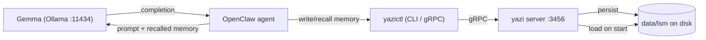

# Running yazi Locally as an Agent Memory Backend

This guide shows how to run **yazi entirely on your machine** and use it as the
persistent memory backend for a local agent stack — specifically **OpenClaw**
(the agent harness) driven by a **local Gemma model** (via Ollama or a similar
runtime).

Everything here is **offline and free at the margin**: no cloud, no external
APIs for storage/retrieval, no embedding service. This is yazi's
[cost-aware](./STATE-OF-ART.md) sweet spot — deterministic, indexed memory at
~zero token cost, which matters most when you are running a small local model
with a limited context window.

---

## 1. The Local Stack

```
                  prompt (with recalled memory)
   ┌───────────────────────────────────────────────┐
   │                                                ▼
┌──┴───────────┐      run tool        ┌──────────────────────┐
│  OpenClaw    │ ───────────────────▶ │  Gemma (local LLM)   │
│  (agent)     │ ◀─────────────────── │  via Ollama :11434   │
└──┬───────────┘     completion       └──────────────────────┘
   │  yazictl memory ... (gRPC :3456)
   ▼
┌──────────────┐      LSM (WAL+SSTable)   ┌──────────────────┐
│  yazi server │ ──────────────────────▶  │  local disk      │
│  :3456       │                          │  data/lsm/       │
└──────────────┘                          └──────────────────┘
```



Three local processes: **Ollama** serving Gemma, the **OpenClaw** agent, and the
**yazi** server. The agent talks to memory through the `yazictl` CLI (or the
gRPC client directly).

---

## 2. Prerequisites

- **Go** ≥ 1.21 (to build yazi and `yazictl`).
- **Ollama** (or llama.cpp / LM Studio) to run Gemma locally — https://ollama.com
- **OpenClaw**, configured to use your local Gemma model and able to run shell
  commands (so it can call `yazictl`).

> macOS note: if `go build`/`go test` aborts with a `missing LC_UUID` linker
> error, prefix commands with `CGO_ENABLED=0`.

---

## 3. Step 1 — Run yazi locally

Use the local profile (single node, durable LSM on disk, tenant bypass):

```bash
cp config/local.yml config/default.yml   # storage=local, engine=lsm, no tenant
go run ./cmd/yazi                         # starts gRPC server on :3456
```

`config/local.yml` is:

```yaml
protocol: grpc
storage: local
engine: lsm
persistent: scheduled
port: 3456
lsm:
  dir: data/lsm
  memtableMaxEntries: 8
  compactionMaxTables: 4
  walMaxSegmentEntries: 0
```

The LSM engine writes to `data/lsm/` immediately (WAL + SSTables), so memory
survives restarts. Verify in another terminal:

```bash
go run ./cmd/cli memory basic put --json '{"kind":"preference","scope":"user","subject":"assistant","content":"answer briefly first","tags":["style"]}'
go run ./cmd/cli memory basic list --filter '{"scope":"user","limit":10}'
```

---

## 4. Step 2 — Run Gemma locally

With Ollama:

```bash
ollama pull gemma3          # or gemma3:4b / gemma2 — pick a size your machine can run
ollama run gemma3           # interactive, or just `ollama serve` to expose the API
```

Ollama serves an OpenAI-compatible API at `http://localhost:11434`. Point
OpenClaw's model configuration at that endpoint and model name. Small Gemma
variants (1B–4B) run comfortably on a laptop; their **small context windows** are
exactly why offloading long-term memory to yazi pays off.

---

## 5. Step 3 — Make `yazictl` available to the agent

Build the CLI and put it on the agent's `PATH`:

```bash
go build -o yazictl ./cmd/cli
sudo mv yazictl /usr/local/bin/     # or anywhere on PATH
```

Now OpenClaw can shell out to `yazictl memory ...`. The CLI defaults to
`grpc`, host `127.0.0.1`, port `3456`.

> **Heads-up on commands.** The current CLI uses **structured** memory commands —
> `yazictl memory <basic|advanced|policy> <put|get|list|del>`. The older
> `yazictl memory save/load <key> <file>` form described in
> `openclaw-instructions.md` is **not implemented** in this build. For
> free-form blobs (e.g. a daily markdown log) use the raw KV commands instead:
> `yazictl set <key> "<text>"` and `yazictl get <key>`.

---

## 6. Step 4 — The Memory Loop

A local agent uses yazi in a simple **recall → act → remember** loop each turn:

1. **Recall (before prompting Gemma).** Pull only the relevant memories and
   inject them into the prompt. Keep it small — local models have little context.
   ```bash
   yazictl memory basic list   --filter '{"scope":"user","limit":5}'
   yazictl memory policy list  --filter '{"role":"coder","limit":3}'
   ```
2. **Act.** OpenClaw builds the prompt (system + recalled memory + user turn) and
   calls Gemma via Ollama.
3. **Remember (after the turn).** Persist new durable facts:
   ```bash
   yazictl memory basic put --json '{"kind":"decision","scope":"project","subject":"build","content":"use CGO_ENABLED=0 on this mac","tags":["build","env"]}'
   ```
4. **Distill (periodically).** Summarize repeated raw memories into an *advanced*
   memory, and link the evidence:
   ```bash
   yazictl memory advanced put --json '{"title":"response-style","summary":"user prefers concise-first answers","template":"style","evidence":["<basic-id>"],"tags":["style"]}'
   ```

Retrieval here is **deterministic and indexed** — no embedding model runs, no LLM
call happens *inside* recall — so a turn's memory overhead is a couple of cheap
local gRPC round-trips, not tokens.

---

## 7. Mapping Memory Layers to a Local Agent

| yazi layer | Use it for | When the agent writes it |
| --- | --- | --- |
| **basic** (preference / history / decision / context) | raw facts: user prefs, choices made, observations | continuously, post-turn |
| **advanced** (title / summary / evidence) | distilled patterns of behavior/working style | periodically, from basics |
| **policy** (role / domain / scenario) | reusable rules: "as a coder, verify with tests first" | once per role/scenario, rarely changes |

Recommended recall order for a small-context model: **policy** (cheap, high-value
rules) → **advanced** (compact summaries) → a few **basic** records if budget
remains. This keeps the injected context minimal — the read-side of being
cost-aware.

---

## 8. Worked Example (a coding session)

```bash
# 1. One-time: record a working policy for the coder role
yazictl memory policy put --json '{"role":"coder","domain":"go","scenario":"bugfix","policy":"run go test before declaring done","tags":["engineering"]}'

# 2. Each turn — recall first
POLICIES=$(yazictl memory policy list --filter '{"role":"coder","limit":3}')
PREFS=$(yazictl memory basic list --filter '{"scope":"user","limit":5}')
# ... OpenClaw injects $POLICIES and $PREFS into the Gemma prompt ...

# 3. After the turn — remember what was decided
yazictl memory basic put --json '{"kind":"decision","scope":"project","subject":"deps","content":"avoid adding aws-sdk; use stdlib SigV4","tags":["deps","cost"]}'

# 4. Restart-proof: stop and restart `go run ./cmd/yazi`, then re-run the recalls —
#    the records are still there (persisted to data/lsm).
```

---

## 9. OpenClaw System-Prompt Rules

Add a block like this to OpenClaw's system prompt / `MEMORY.md` so the agent uses
yazi consistently (commands match the current CLI):

```markdown
# External Memory (yazi)

You have a local memory backend reachable via the `yazictl` CLI (yazi server on
127.0.0.1:3456). Use it every turn:

- BEFORE answering, recall relevant memory:
  - `yazictl memory policy list --filter '{"role":"<role>","limit":3}'`
  - `yazictl memory basic  list --filter '{"scope":"user","limit":5}'`
- AFTER a turn, persist durable facts (preferences, decisions, context) as basic
  memory:
  - `yazictl memory basic put --json '{"kind":"decision","scope":"project","content":"...","tags":["..."]}'`
- Periodically distill repeated facts into advanced memory with `evidence` ids.
- For large free-form notes (markdown logs), use `yazictl set <key> "<text>"`
  and `yazictl get <key>`.
Keep recalled context small — prefer policy and advanced summaries over dumping
many raw records.
```

---

## 10. Multiple Local Agents (optional)

If you run several agents/projects on one machine and want their memories kept
separate, give each a tenant id — keys are namespaced under `tenant/<id>/...`
while everything stays in the same local store:

```bash
yazictl --tenant project-a memory basic list --filter '{"scope":"user"}'
yazictl --tenant project-b memory basic put  --json '{"kind":"context","content":"..."}'
```

Omit `--tenant` for the default shared (bypass) namespace.

---

## 11. Persistence & Data Location

- Memory lives in `data/lsm/` (WAL + SSTables) when `engine: lsm`.
- It is reloaded on server start, so restarts are transparent.
- To reset local memory, stop the server and delete `data/lsm/`.
- Snapshot/cloud mode (S3) is a config change away — see
  [ARCHITECTURE.md](./ARCHITECTURE.md) — but for local use, disk is enough.

---

## 12. Troubleshooting

| Symptom | Fix |
| --- | --- |
| `connection refused` from `yazictl` | yazi server not running, or wrong port — start `go run ./cmd/yazi`, default `:3456` |
| `missing LC_UUID` on build/test (macOS) | prefix with `CGO_ENABLED=0` |
| Gemma not responding | ensure `ollama serve` is up and the model is pulled (`ollama list`) |
| memory empty after restart | confirm `engine: lsm` (not `mem`) and that `data/lsm/` is writable |
| `--port`/`-P` not recognized on subcommands | host/port are root-level flags; run them on the root command, otherwise defaults apply |

---

## Related Docs

- [README.md](./README.md) — overview, goal, running instructions
- [ARCHITECTURE.md](./ARCHITECTURE.md) — four-layer design and diagrams
- [MEMORY.md](./MEMORY.md) — memory data model and schemas
- [STATE-OF-ART.md](./STATE-OF-ART.md) — cost-aware positioning vs other systems
